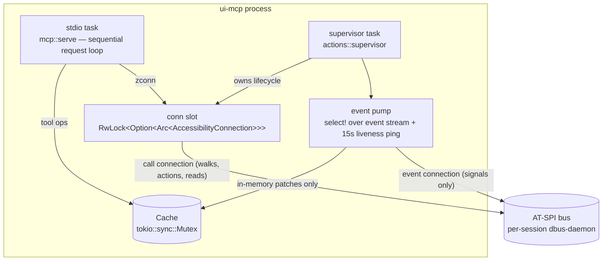

# Process and Connection Model

SIR is one process with three long-lived concerns and **two independent D-Bus connections** to the accessibility bus.

## Why two connections

Discovered empirically ([[ADR - Dual D-Bus Connections]]): a busy application (Firefox mid-load) emits hundreds of `ChildrenChanged` signals. With a single shared socket:

1. a tool call takes the cache lock and starts a tree walk (method calls),
2. the event pump can't take the lock, stops draining the stream,
3. undrained signals back up the shared socket,
4. the walk's **own method replies** queue behind them,
5. every call hits its 2s timeout → the walk dies at a handful of nodes.

Symptom in the log: `walk of app-1 hit time budget at 6 nodes`. With separate sockets, a signal flood delays only event processing — never control operations. Verified: the same scenario resolves Firefox's button in ~10s ([[Flow - Dual Connection Architecture]]).

## Tasks

- **stdio loop** ([[mcp.serve]]): reads one JSON-RPC message per line, dispatches, writes one line. Requests are handled sequentially — ordering is deterministic and the cache lock is uncontended by other requests.
- **supervisor** ([[actions.supervisor]]): owns both connections; connect → register events → initial enumeration → pump; on stream end or failed liveness ping, clears the connection slot (tools fail fast with a clear error) and reconnects with 0.5s→10s exponential backoff. See [[Reconnection]].
- **event pump**: strictly in-memory cache patching; **zero D-Bus I/O** in the handler ([[ADR - No IO in Event Handler]]).

## Locking

Single `tokio::sync::Mutex<Cache>`. Tool operations hold it across their resolution + walk; the pump takes it per event. Walks bound their hold time via the walk budget ([[Timeout Model]]). The connection slot is a `RwLock` read by every tool call, written only by the supervisor on connect/disconnect.
