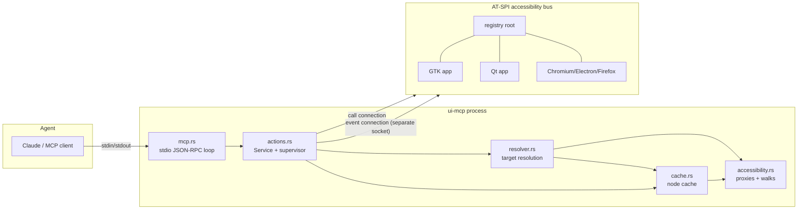

# System Overview

SIR is a single Rust process (`ui-mcp`, ~2600 lines across 7 modules) bridging two worlds:

- **Upward**: an MCP server on stdio — newline-delimited JSON-RPC 2.0 ([[MCP Interface]])
- **Downward**: the AT-SPI accessibility bus over D-Bus, via the `atspi` crate ([[AT-SPI Integration]])

## Module responsibilities

| Module | Role | Doc |
|---|---|---|
| `main.rs` | entrypoint: MCP server by default, `cli` subcommand for development | [[Module - main]] |
| `mcp.rs` | JSON-RPC framing, tool schemas, dispatch | [[Module - mcp]] |
| `actions.rs` | `Service` (the 9 tool operations), connection supervisor, event pump | [[Module - actions]] |
| `resolver.rs` | target → node_ref with strict precedence and no silent disambiguation | [[Module - resolver]] |
| `cache.rs` | in-memory apps/windows/controls model, walks, event patching | [[Module - cache]] |
| `accessibility.rs` | AT-SPI proxy construction, node inspection, timeouts | [[Module - accessibility]] |
| `types.rs` | `Target`, `ControlRef`, `UiError` | [[Module - types]] |

## Key invariants

1. **Text only.** Every operation is a D-Bus method call on an accessibility object. See [[00 - SIR Home]].
2. **Refs are stable while the object lives.** Re-walks reuse refs; only object/app death invalidates them ([[Resolution and References]]).
3. **Never choose silently.** Multiple matches → `ambiguous` with candidates ([[Error Model]]).
4. **One bad app cannot freeze SIR.** Every AT-SPI call is timeout-bounded; walks have a wall-clock budget ([[Timeout Model]]).
5. **Events and control traffic never share a socket** ([[Process and Connection Model]]).
6. **The connection is supervised.** Bus death → reconnect with backoff + full re-enumeration ([[Reconnection]]).
