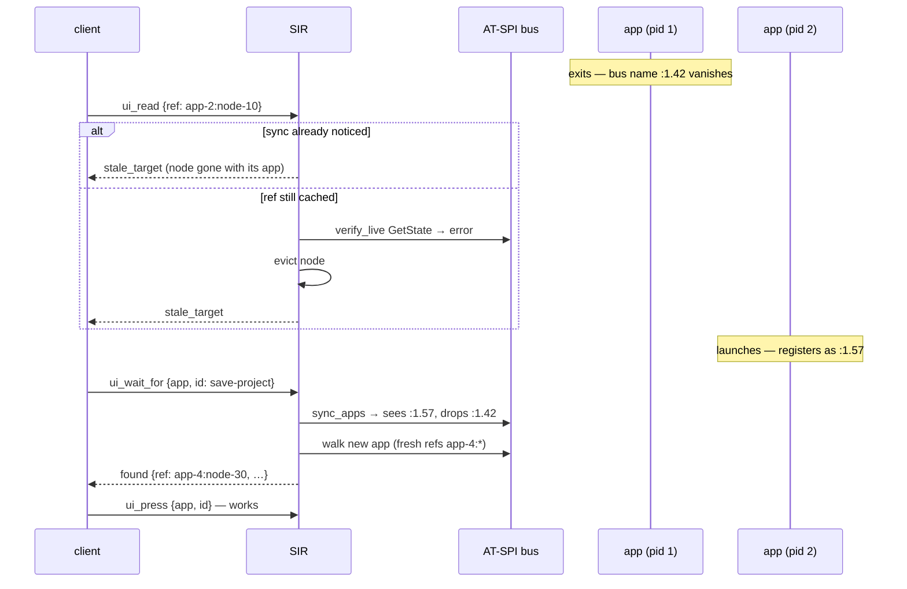

# Flow: App Restart Recovery

An application exits and relaunches. No SIR connection is involved — the app just leaves and rejoins the bus under a new unique name. Code: [[cache.Cache.sync_apps]], [[resolver.verify_live]].

Facts:

- Old refs answer `stale_target` (re-find), never `not_found` (doesn't exist) — the distinction matters to callers ([[Resolution and References]]).
- The new instance gets **new refs**; IDs are the durable addressing mode across restarts.
- Verified by the `restart` battery: *ref to exited app → stale_target*, *relaunched app resolvable without server restart*.
