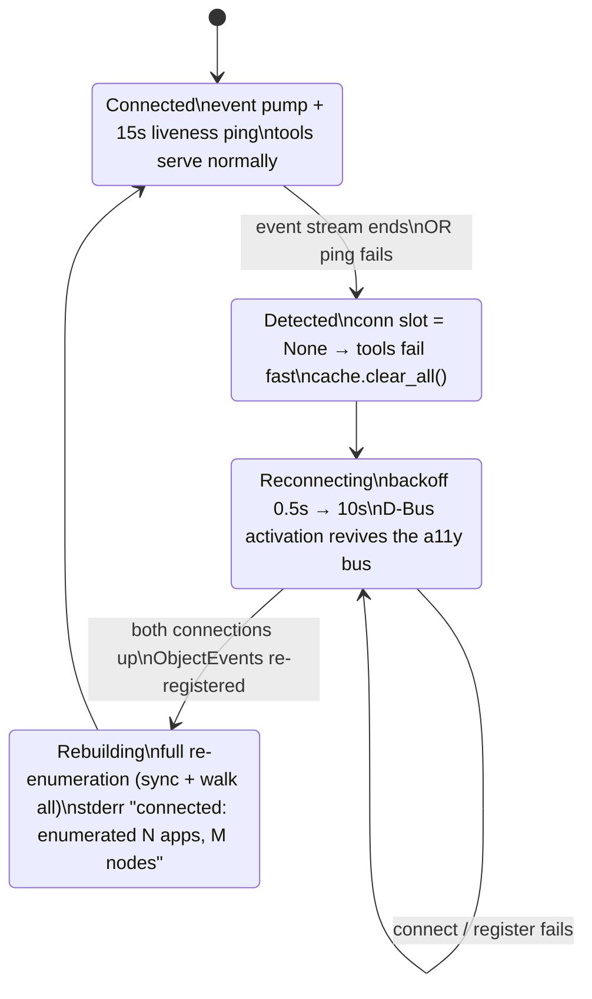

# Flow: Bus Restart Recovery

The accessibility bus itself dies (registry crash, session restart). Code: [[actions.supervisor]], [[actions.liveness_ping]]. Policy: [[Reconnection]].

During the outage window every tool call returns
`atspi_error: accessibility bus disconnected; reconnecting — retry shortly` — fail-fast, no hang, no panic.

All session refs from before the reconnect are stale by construction (the bus reassigns unique names); clients re-find by ID.

Verified by [[Bus Restart Test]] (4/4): baseline press → `pkill -9 at-spi2-registryd at-spi-bus-launcher` → outage calls return cleanly → recovery detected by polling `ui_list_apps` → press works again. The test relaunches the fixture app because a killed registry orphans existing app registrations (see [[Unresolved Questions]] on in-place re-embedding).
