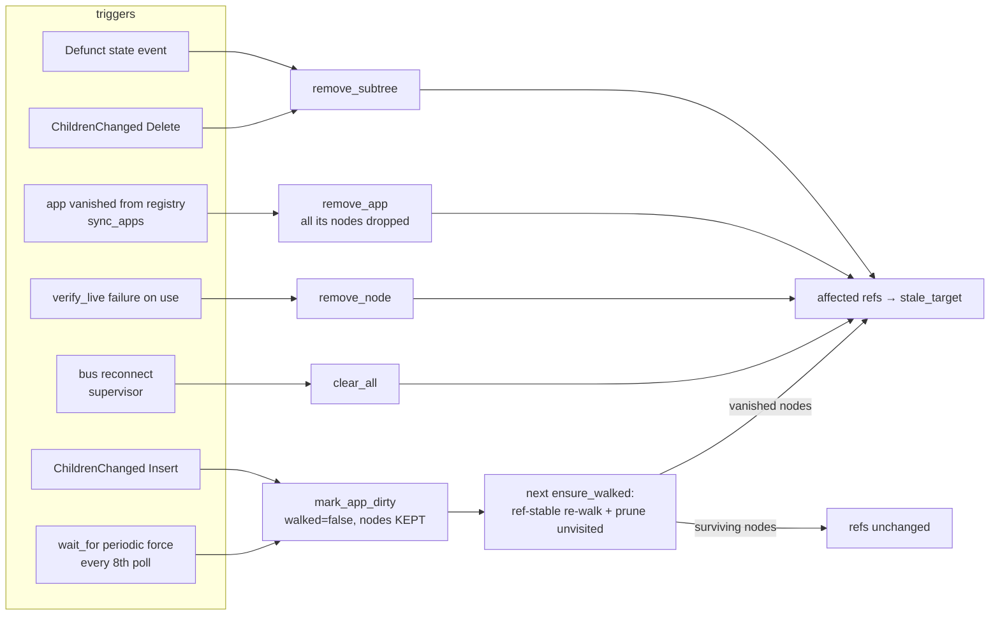

# Flow: Cache Invalidation

Every path by which cache entries stop being served, and what each does to session refs. Code: [[Module - cache]].

The invariant across all paths: **a ref dies only when its object is genuinely gone** (or the whole connection was rebuilt). Dirty-marking and re-walking never invalidate refs of living objects — enforced by `node_by_key` reuse and prune-only-unvisited in [[cache.Cache.walk_app]].
