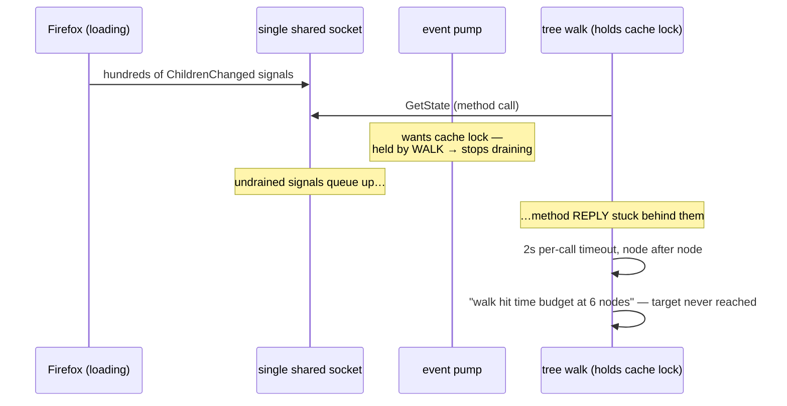
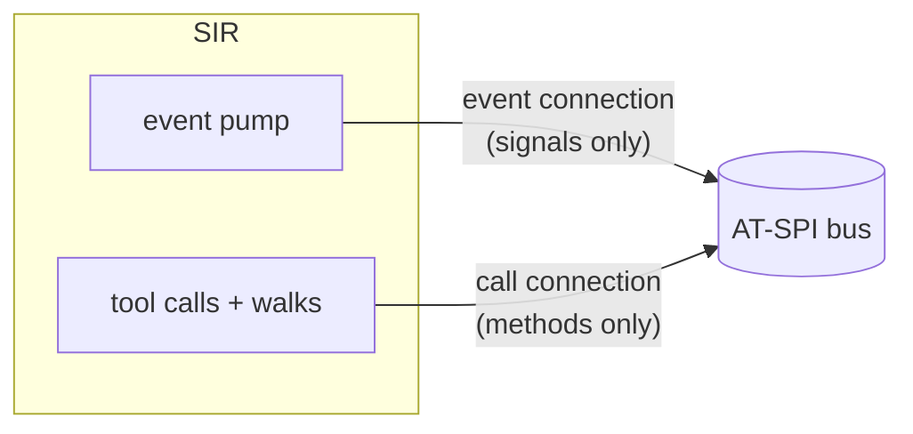

# Flow: Dual Connection Architecture

Why event and control traffic use **separate D-Bus connections** — the failure this prevents, drawn from the actual incident. Decision record: [[ADR - Dual D-Bus Connections]].

## The failure with one shared socket (historical)

Deadlock-by-congestion: the walk starves itself through the pump it blocked.

## The fix (current)

A signal flood now saturates only the event socket; method replies flow unimpeded on their own connection. Combined with the no-I/O event handler ([[ADR - No IO in Event Handler]]), a chatty application can at worst delay cache freshness — never control.

Measured effect: long-lived server finds Firefox's button ~10s after launch (previously: never). Both connections are built, registered, torn down, and rebuilt together by [[actions.supervisor]].
