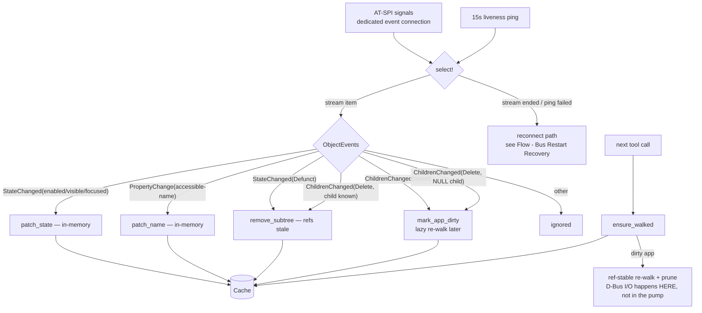

# Flow: Event Processing

Traced from the pump loop in [[actions.supervisor]] → [[actions.handle_event]]. Policy: [[Event Processing]].

Facts:

- The handler performs **no D-Bus I/O** — the single most important rule in the file ([[ADR - No IO in Event Handler]]).
- Insert is lazy (dirty flag), Delete is eager (in-memory prune) — rationale in [[Event Processing]].
- Verified live: window-title rename propagated to a `ui_wait_for` match; *dynamically added widget found via events* check.
