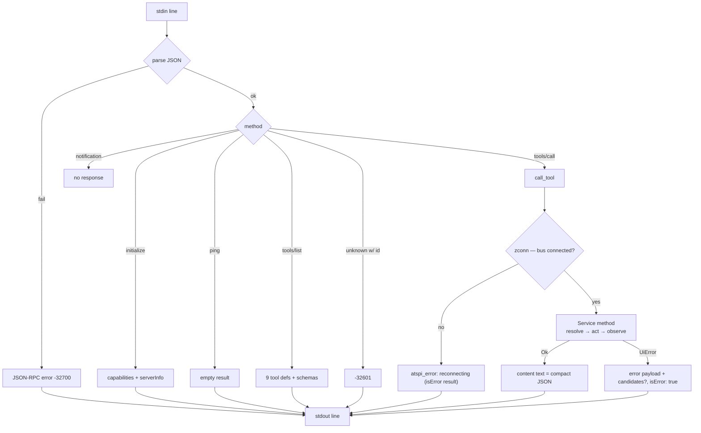

# Flow: MCP Request Handling

Traced from [[mcp.serve]] → [[mcp.call_tool]] → [[actions.Service|Service]].

Facts:

- Requests are handled **sequentially** in arrival order; there is no per-request concurrency ([[Process and Connection Model]]).
- Tool-level failures never surface as protocol errors — a client always gets a structured [[Error Model]] payload it can act on.
- Verified by the `core` battery: malformed JSON, unknown method, unknown tool, ignored notification, clean EOF ([[Acceptance Suite]]).
