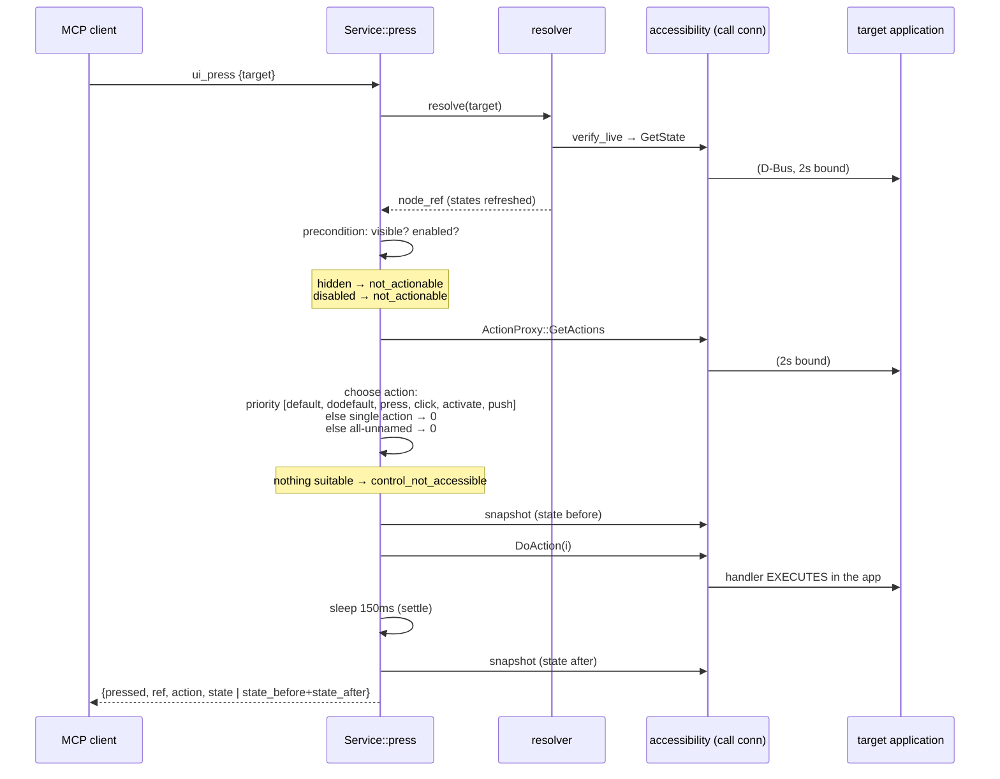

# Flow: Press Action

The canonical end-to-end operation, traced from [[actions.Service.press]]. The success condition of the whole project: `ui_press {app, id}` executes the app's handler with zero synthetic input.

Facts:

- Preconditions use **live** states from `verify_live`, then the action list is fetched fresh — a control disabled milliseconds ago fails correctly.
- Action names are normalized before matching ([[actions.action_names]], [[ADR - Action Name Normalization]]).
- Identical before/after snapshots collapse to a single `state` ([[Output Conventions]]).
- Latency: dominated by the deliberate 150ms settle — measured in [[Baseline (2026-07-14)]].
- Exercised on all five toolkits by the [[Acceptance Suite]].
