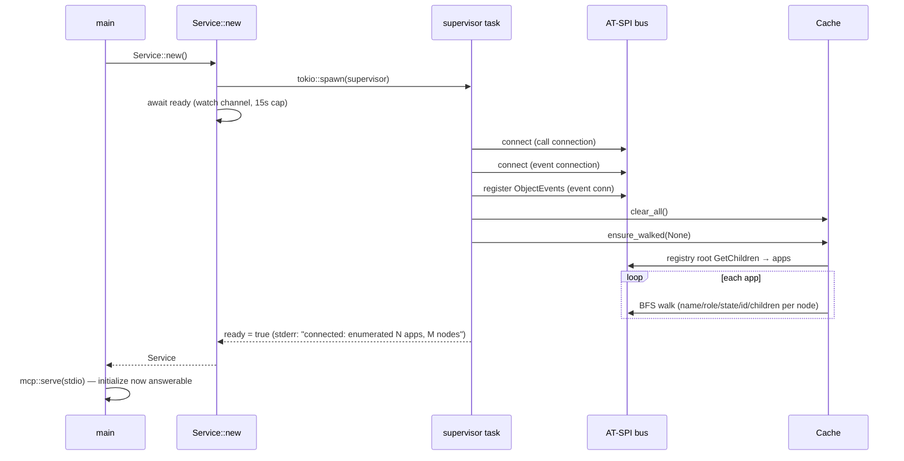

# Flow: Startup and Initial Enumeration

Traced from [[main.main]] → [[actions.Service.new]] → [[actions.supervisor]] → [[cache.Cache.ensure_walked]].

Facts:

- Enumeration is **automatic and complete before the first MCP response** — `Service::new` blocks on the supervisor's ready signal (15s cap, else fatal).
- The same path re-runs after every reconnect ([[Flow - Bus Restart Recovery]]).
- Walk caps apply from the very first walk ([[Timeout Model]]).
- Measured: see [[Baseline (2026-07-14)]] `startup_to_initialize_ms` / `initial_enumeration_ms`.
