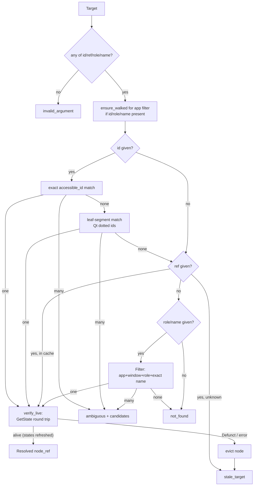

# Flow: Target Resolution

Traced from [[resolver.resolve]] + [[resolver.verify_live]]. Policy: [[Resolution and References]].

Facts:

- The winning strategy must produce **exactly one** node; multiple always error with candidates — never a silent pick.
- `verify_live` refreshes `enabled/visible/focused` on success, so action preconditions ([[Flow - Press Action]]) are live, not cached.
- Exercised by: *find Save by id*, *duplicate controls → ambiguous*, *unknown id → not_found*, *removed widget ref → stale_target*.
