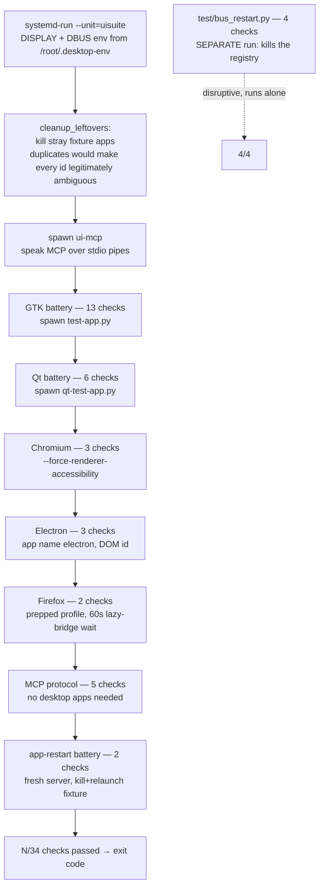

# Flow: Test Suite Execution

How [test/suite.py](../../../test/suite.py) validates the system end-to-end. Details: [[Acceptance Suite]], [[Test Harness]].

Facts:

- Each toolkit runner **owns its app's lifecycle** (spawn → test → kill); browsers launch detached (`start_new_session`) because their fork storms can kill a parent's SSH channel.
- The suite runs as a **systemd transient unit**, never on an interactive SSH channel — survives connection drops, output via journald/file.
- [[Bus Restart Test]] is deliberately excluded from the main run: it kills the session's AT-SPI registry.
- Expected totals, verified at baseline: **34/34** and **4/4** ([[Baseline (2026-07-14)]]).
